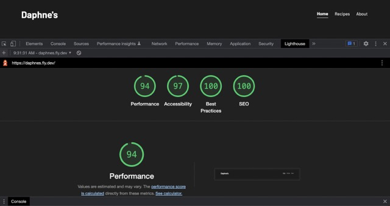

# Daphne's

This is a web app for a home bar in Chicago, IL.

## Table of contents

- [Overview](#overview)
- [Links](#links)
- [My process](#my-process)
  - [Built with](#built-with)
  - [What I learned](#what-i-learned)
  - [Continued development](#continued-development)
  - [Useful resources](#useful-resources)
- [Author](#author)

## Overview

The idea for Daphne's started before I knew how to code. I made [a Wordpress site](https://daphnes.bar) where I hosted pictures and descriptions of the cocktails I liked to make at home. Once I started learning how to code, I graduated to a simple static site I made out of HTML and CSS with each cocktail being a separate HTML file.

After I started learning Javascript, I made a single page app out of vanilla JS that could consume data from external APIs. [My wife](https://victoriagerman.com) designed the site for me in Figma and I used those files to create the UI. All the exisiting cocktail APIs were underwhelming so I learned how to create one using Node, Express and MongoDB with Mongoose.

I have since then rebuilt the UI with React and added more features such as the ability to log in as an admin to create, delete and update recipes in the database. I wrote some integration tests with Jest and some end-to-end tests with Cypress. I also set up a CI/CD pipeline with Github Actions.

### Users should be able to:

- View cocktail recipes
- Filter recipes by ingredient
- View weekly menu
- Search recipes based on tags

### Admins should be able to:

- Log in with username and password
- Add new recipes
- Update exisiting recipes
- Delete recipes

### Links

- [View live site](https://daphnes.fly.dev/)
- [View code](https://github.com/dominicgerman/daphnes_fullstack)

## My process

### Built with

- [React](https://reactjs.org/) - JS library
- [Express](https://expressjs.com/) - Node framework
- [Styled Components](https://styled-components.com/) - For styles
- [MongoDB](https://www.mongodb.com/) - NoSQL database
- [Cypress](https://www.cypress.io/) - End-to-end testing

### What I learned

- In this specific iteration of Daphnes, I learned a lot about configuration. This was my first time using GitHub Actions and my first time deploying with Fly.io so getting the pipeline to work as expected definitely took some time. Same goes for testing -- I wrote the tests after I wrote the code and I wound up spending a lot of time just trying to get the tests to pass even though the code worked as expected.

- I really wanted to try Styled Components on this project. I found it to be a fairly enjoyable experience but ultimately, I still prefer Tailwind and/or CSS Modules.

- I learned a lot about performance, especially image optimization. In the earlier incarnations of Daphnes, my image files were way too big and were causing performance issues. This version's lighthouse scores are considerably better than previous versions:

### Continued development

- I'd like users to be able to create their own recipes. This would involve rethinking a lot of things including images.
- If users were able to create their own recipes, I'd like to have a built-in ABV calculator that told you how boozy your recipe was and how many standard units of alcohol it contained.
- I'd like to migrate to Vite in the near future. I believe it would improve the performance even more.
- I'd like to write more and better tests for this app.
- I would love to turn this into a React Native app in the future.

### Useful resources

- [Full Stack Open](https://fullstackopen.com/en/) - This online web development course introduced me to so many new concepts and tools that I used in building this app, far too many to list. Some of the biggest ones would be React itself, testing Node and React apps with Jest and React Testing Library, end-to-end testing with Cypress, React Router, and CI/CD pipelines. It also deepened my understanding of crucially important concepts like promises, async/await, auth, databases and managing state.
- [React docs](https://beta.reactjs.org/) - It probably goes without saying but the Beta React docs are phenomenal.

## Author

- [Personal site](https://www.dominicgerman.com)
- [LinkedIn](https://www.linkedin.com/in/dominic-german/)
